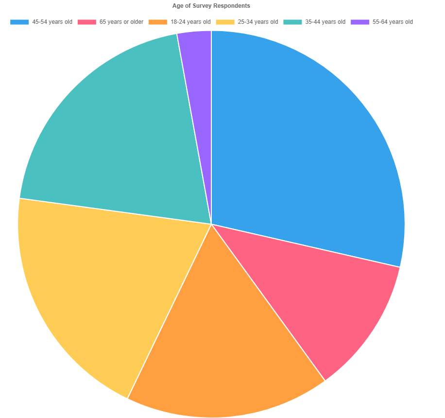
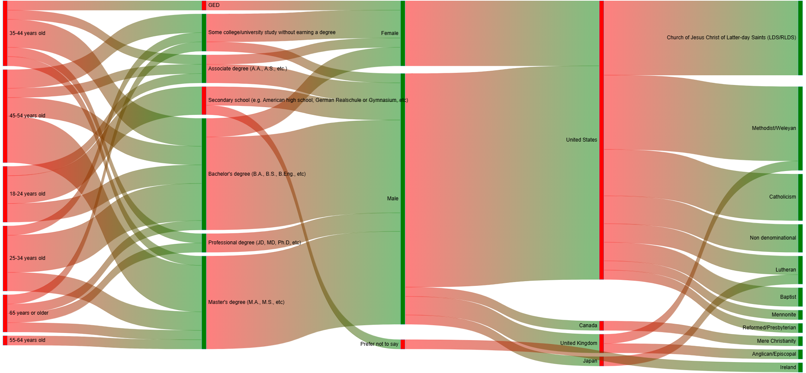
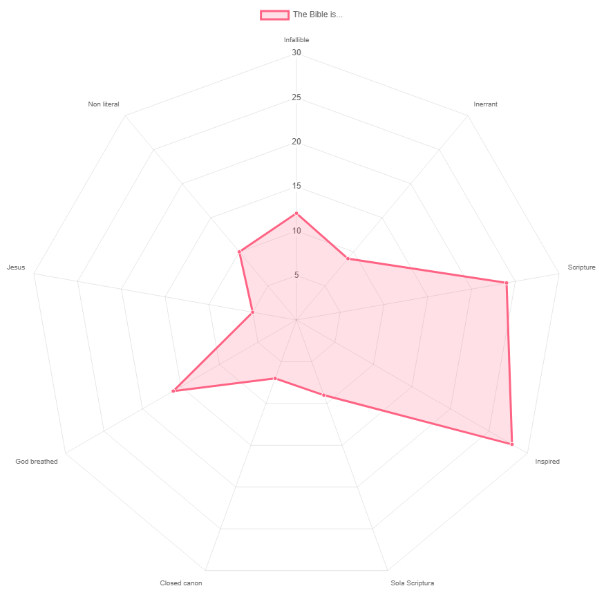
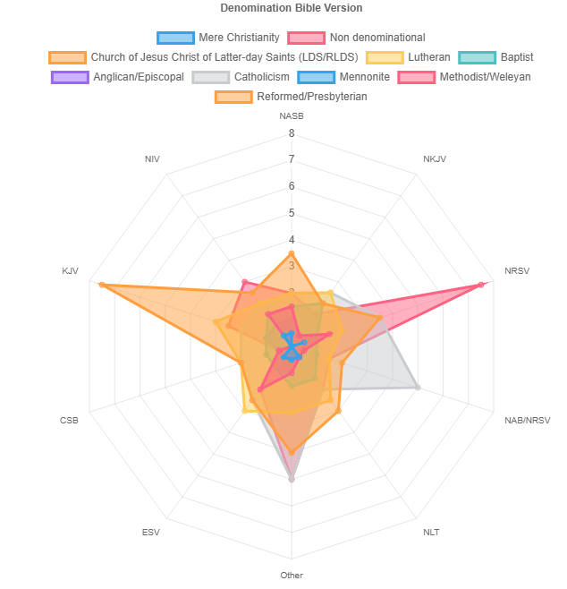
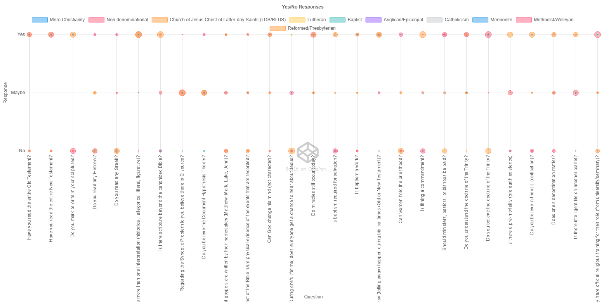
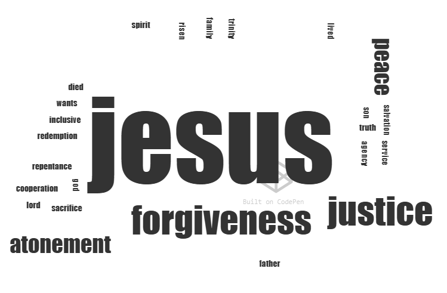

# Charts/Graphs

Pie Chart:
- [Age of Survey Respondents](https://codepen.io/depperm/full/OPWZJJY?show=preview)

  

Sankey:
- [Demographics](https://codepen.io/depperm/full/qERYOMQ?show=preview)

  

Radar:
- [Bible is](https://codepen.io/depperm/full/gbgzaqp?show=preview)

  
- [Denomination Bible Version](https://codepen.io/editor/depperm/pen/01a0ce88-fab7-7953-8dd2-445a5814f945?show=preview)

  

Bubble:
- [Beliefs Yes/No](https://codepen.io/editor/depperm/pen/01a0d3bf-f1af-7d68-b11c-18b3bd5fb1cf?show=preview)

  

Word Cloud:
- [Christianity Is](https://codepen.io/editor/depperm/pen/01a0d572-365a-7f28-80f7-d737d84082d0?show=preview)

  

Topics People are Interested in Studying/Learning in the upcoming Year
- love
- sexuality and the bible
- nature of God
- ecumenism
- eschatology
- church and state
- church history Catholicism Protestant apologetics
- Heavenly Mother
- Israel dispensationalism replacement theology
- confessional lutheran dogmatics
- biblical trinity
- apologetics/evidence
- peace theology
- Christology
- apocrypha
- spiritual gifts
- Enoch
- Catholic doctrine
- our role as Christians
- book of Acts
- Mary of Nazareth